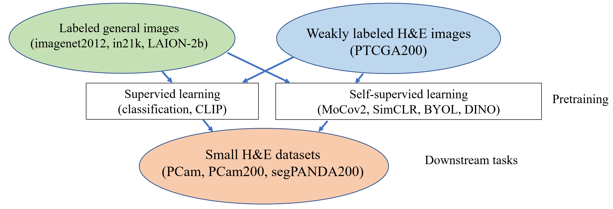

[](https://opensource.org/licenses/Apache-2.0)
# PatchTCGA
Paper: [Large-scale pretraining on pathological images for fine-tuning of small pathological benchmarks](https://arxiv.org/abs/2303.15693)

Overview: 


# DATASETS
We engineered three patch-based one large and two small datasets. They are designed to conduct large-scale training and downstream benchmarking, respectively. They have the same microns per pixel (MPP) of 0.39. MD5 checksums are available in the download links. Please refer the original paper for details.


## Patch TCGA in 200μm (PTCGA200)

Donwload Link: https://drive.google.com/drive/folders/18CmL-WLyppK1Rk29CgV7ib5MACFzg5ei?usp=drive_link

License: [NIH Genomic Data Sharing (GDS) Policy](https://datascience.cancer.gov/data-sharing/genomic-data-sharing/about-the-genomic-data-sharing-policy)

Use the snippet below to make the original archive from divided files.
```
$ cat PTCGA200_p_* > PTCGA200.tar.gz
```

## Patch Camelyon in 200μm (PCam200): 

Donwload Link: https://drive.google.com/drive/folders/1Oh7onawKsDW5ScamVO5ByXFgqdYJ39sK?usp=drive_link

License: CC0 [](http://creativecommons.org/publicdomain/zero/1.0/)

## Segmentation PANDA in 200μm (SegPANDA200): 

Donwload Link: https://drive.google.com/drive/folders/1zg_C37B_1HR6miRFuTwPKmueaJzvO-GD?usp=drive_link

License: CC BY-SA-NC 4.0 [](https://creativecommons.org/licenses/by-nc-sa/4.0/)

# Getting Started

### Train
Download datasets and modify the config.py file. Then, run the following command.

```
python train.py
```


# Pretrained Models

Under permission process.

# Citation
Provisional

```
@CoRR{PatchTCGA,
  title={Large-scale pretraining on pathological images for fine-tuning of small pathological benchmarks},
  author={Masataka Kawai, Nriaki Ota, Shinsuke Yamaoka},
  booktitle={},
  year={2023}
}
```

# Acknowledgement
We thank the authors of the original datasets for their efforts. We also thank the authors of the following repositories for their contributions.

- [Camelyon16](https://doi.org/10.1001/jama.2017.14585.)
- [PANDA]( https://doi.org/10.1038/s41591-021-01620-2.)

This work is based on results obtained from a project, JPNP20006, commissioned by the New Energy and Industrial Technology Development Organization (NEDO). 